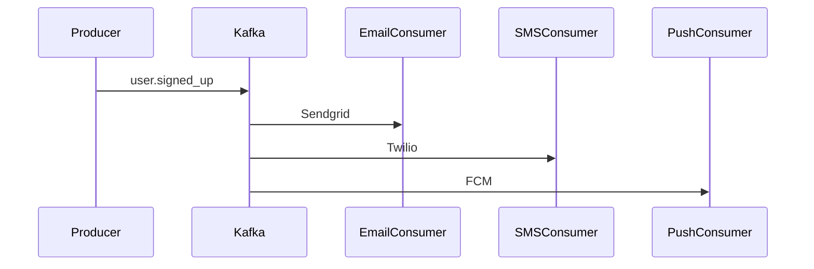

# Architecture: Event-Driven Notification Service

## System Diagram
The following Mermaid.js sequence diagram maps the core workflow and interactions:

## Component Breakdown
- **Core Technology**: TypeScript, KafkaJS, Node.js
- **Design Paradigm**: Emphasizes high availability, fault tolerance, and security.
